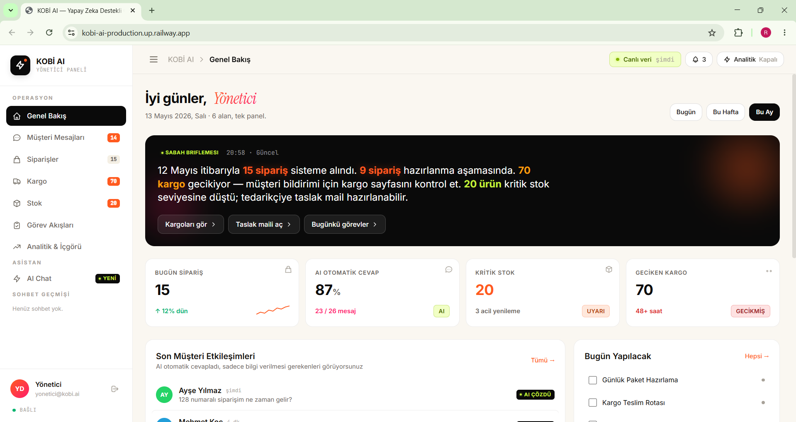
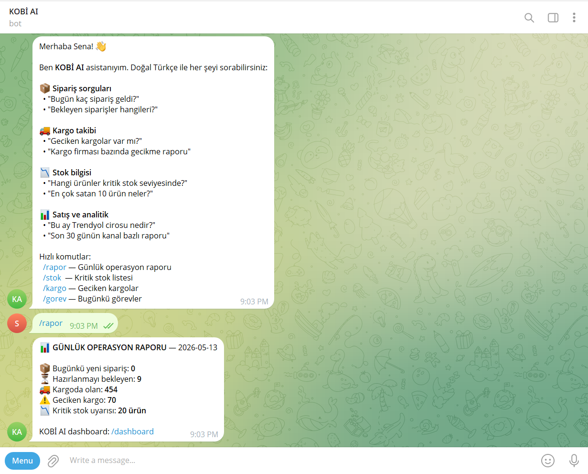
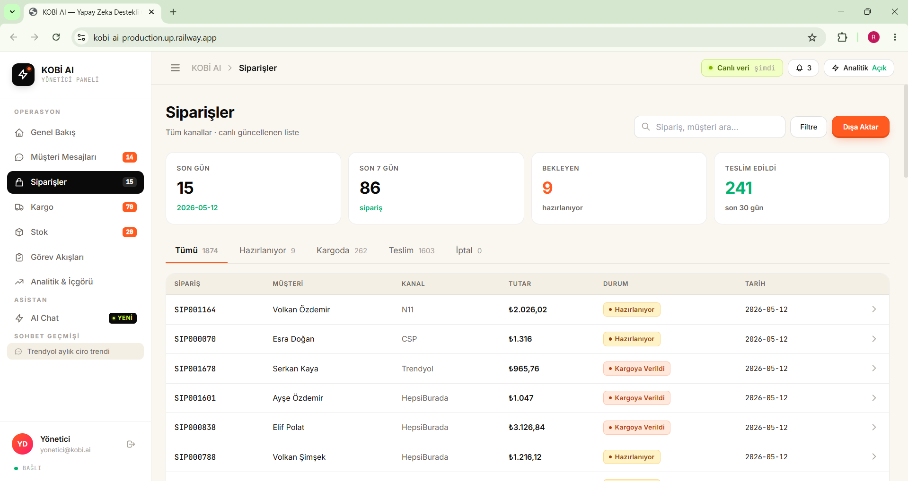

# 🤖 KOBİ AI — Yapay Zeka Destekli Operasyon Platformu

<div align="center">

**AI Akademi Hackathon 2026**

[](https://kobi-ai-production.up.railway.app)
[](https://t.me/mikroai_bot)
[](https://github.com/rabiasenauysal/kobi-ai)

🌐 **[https://kobi-ai-production.up.railway.app](https://kobi-ai-production.up.railway.app)**

*KOBİ'lerin günlük operasyonlarını yapay zeka ile otomatikleştiren, Türkçe doğal dil anlayan entegre platform.*

</div>

---

## 🎯 Problem & Çözüm

| | |
|---|---|
| **Problem** | KOBİ'ler sipariş, kargo, stok ve müşteri iletişimini birbirinden kopuk, manuel araçlarla yönetiyor. |
| **Çözüm** | Telegram botu, canlı dashboard ve doğal dil SQL asistanıyla tüm operasyonu tek platformda otomatikleştiriyoruz. |

---

## 📸 Ekran Görüntüleri

<div align="center">

### 📊 Ana Dashboard


### 💬 Telegram Bot & Sohbet Geçmişi


### 📦 Sipariş & Kargo Takibi


</div>

---

## ✅ Kapsanan 6 Senaryo

| # | Senaryo | Nasıl Çalışır |
|---|---------|--------------|
| 1 | **Müşteri İletişim Otomasyonu** | Telegram bot — doğal dil sipariş/kargo sorgusu, 7/24 otomatik yanıt |
| 2 | **Ürün & Sipariş Takibi** | Canlı dashboard — bugünkü siparişler, bekleyen, kargodaki |
| 3 | **Kargo Süreç Yönetimi** | Geciken kargo tespiti, yöneticiye otomatik Telegram bildirimi |
| 4 | **Stok & Envanter Yönetimi** | Kritik stok uyarısı, AI destekli tedarikçi mail taslağı |
| 5 | **İş Akışı & Görev Yönetimi** | Her sabah 08:00 rol bazlı görev listesi Telegram'a otomatik gönderim |
| 6 | **Analitik & İçgörü** | 30/90/365 gün trend, kanal dağılımı, doğal dil SQL chat asistanı |

---

## 🏗️ Mimari

```
Frontend (Vanilla JS + Tailwind CSS)
        ↕
FastAPI Backend  ←→  Railway Cloud (Production)
    ├── SQL Agent (LangGraph + GPT-4o-mini + ChromaDB RAG)
    ├── Telegram Bot (Webhook — doğal dil → SQL → cevap)
    ├── APScheduler (08:00 sabah görevi · 30dk kargo · 60dk stok)
    └── SQLite (8.600+ sipariş · 100 ürün · 5 e-ticaret kanalı)
```

**Tech Stack:**
`Python` · `FastAPI` · `SQLite` · `ChromaDB` · `OpenAI GPT-4o-mini` · `LangGraph` · `APScheduler` · `Telegram Bot API` · `Railway`

---

## 🚀 Yerel Kurulum

```bash
git clone https://github.com/rabiasenauysal/kobi-ai.git
cd kobi-ai
pip install -r requirements.txt
cp .env.example .env
# OPENAI_API_KEY, TELEGRAM_BOT_TOKEN, TELEGRAM_ADMIN_CHAT_ID ekle
python main.py setup
python main.py web
# → http://localhost:8000
```

---

## ☁️ Canlı Demo (Railway)

Proje Railway üzerinde containerize edilmiş olarak **aktif şekilde çalışmaktadır**.

🔗 **[https://kobi-ai-production.up.railway.app](https://kobi-ai-production.up.railway.app)**

---

## 💬 Telegram Bot

**[@mikroai_bot](https://t.me/mikroai_bot)** — Telegram'da arayın ve test edin!

```
/start  → Karşılama & yardım menüsü
/rapor  → Günlük operasyon raporu
/stok   → Kritik stok listesi
/kargo  → Geciken kargolar
/gorev  → Bugünkü aktif görevler

Doğal dil: "Bugün kaç sipariş geldi?"
           "Trendyol'dan son 30 günün cirosu?"
           "Hangi ürünler kritik stok seviyesinde?"
```

---

## 📁 Proje Yapısı

```
├── api.py                    # FastAPI uygulama + tüm route'lar
├── main.py                   # CLI giriş noktası
├── Dockerfile                # Railway container
├── services/
│   ├── rag_service.py        # RAG-First + konuşma hafızası
│   ├── sql_agent.py          # LangGraph Text-to-SQL ajanı
│   ├── telegram_bot.py       # Telegram webhook handler
│   ├── alert_service.py      # Kargo/stok/görev bildirimleri
│   └── scheduler.py          # APScheduler zamanlanmış görevler
├── static/
│   ├── index.html            # Tek sayfa uygulama
│   └── app.js                # Frontend logic
└── db/
    ├── kobi_demo.db          # Demo SQLite (8.600+ kayıt)
    └── seed.py               # Sentetik veri üretici
```

---

<div align="center">

*Demo verisi tamamen sentetiktir. Gerçek kişi veya işletme bilgisi içermez.*

**Geliştirici:** Rabia Sena Uysal · AI Akademi Hackathon 2026

</div>
